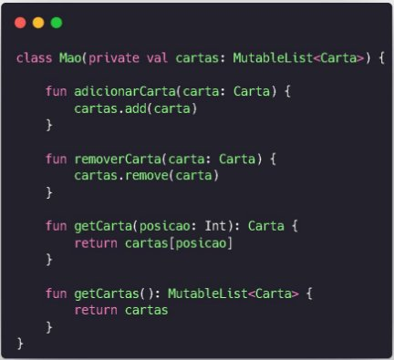

**INSTITUTO FEDERAL DE EDUCAÇÃO CIÊNCIA E TECNOLOGIA DE MINAS GERAIS CAMPUS OURO BRANCO**

**BACHARELADO EM SISTEMAS DE INFORMAÇÃO**

**CARLOS HENRIQUE CENACHI FERREIRA
 
EDUARDO ALESSANDRO SANTANA DE MELO**

**DOCUMENTAÇÃO: TRABALHO PRÁTICO 2**

**BATALHA DE CARTAS COLECIONÁVEIS**

Documentação apresentada a disciplina de de Programação para Dispositivos Móveis, com o objetivo de apresentar de forma documentada toda a implementação do trabalho realizado, utilizando a linguagem de programação Kotlin.

Ouro Branco 2023

**RESUMO**

Seu José é um apaixonado por jogos de cartas colecionáveis, onde jogadores constroem baralhos com cartas que representam personagens, criaturas e habilidades únicas. Ele busca um estudante de Sistemas de Informação para criar um programa que simule um jogo similar a Magic e Yu-Gi-Oh, permitindo que ele e um amigo compartilhem seus baralhos. Durante as rodadas, os jogadores podem posicionar monstros, equipá-los, descartar cartas, atacar o oponente e alterar o estado dos monstros, usando estratégia para vencer.

**SUMÁRIO**

INTRODUÇÃO ...............................................................................................3 
 
DIAGRAMA UML ..........................................................................................4 
 
IMPLEMENTAÇÃO .......................................................................................5 
 
CONCLUSÃO .................................................................................................22

**INTRODUÇÃO**

Este documento descreve a solução implementada para o problema apresentado, que envolve a criação de um simulador de um jogo de cartas colecionáveis, semelhante aos populares Magic e Yu-Gi-Oh. Neste jogo, os jogadores constroem baralhos personalizados a partir de uma coleção de cartas e competem entre si seguindo regras específicas.

Para implementação foi necessário respeitar as regras a seguir para bom funcionamento e andamento do presente jogo desenvolvido.

**Leitura da Coleção de Cartas:** O programa lê as informações das cartas a partir de um documento de texto fornecido, que descreve monstros e equipamentos disponíveis. **Distribuição Inicial de Cartas:** Cada jogador recebe aleatoriamente 5 cartas da coleção para formar sua mão inicial.

**Posicionamento de Monstros:** Os jogadores podem posicionar monstros no tabuleiro em cada rodada, com limite de 5 monstros por jogador. Os monstros podem estar em estado de ataque ou defesa.

**Utilização de Equipamentos:** Os jogadores podem equipar monstros com cartas de equipamento disponíveis na coleção, que afetam os atributos dos monstros.

**Limite de Cartas na Mão**: Cada jogador pode ter no máximo 10 cartas em sua mão. O jogador deve descartar cartas extras se esse limite for ultrapassado.

**Realização de Rodadas:** O jogo é jogado em rodadas, com os jogadores recebendo uma nova carta em cada rodada e escolhendo suas ações.

**Ataques:** Os ataques envolvem escolher um monstro do oponente para atacar. A resolução depende dos estados de ataque ou defesa e dos valores de ataque e defesa dos monstros envolvidos.

**Restrição de Ataque:** Cada monstro só pode atacar uma vez por rodada.

**Pontuação:** Cada jogador começa com 10.000 pontos. O jogo continua até que a pontuação de um jogador alcance 0 ou até que não haja mais cartas no baralho, momento em que o jogador com mais pontos vence.

**Restrição de Ataque Direto:** Os ataques diretos aos pontos de vida do jogador só podem ser realizados a partir da segunda rodada.

**DIAGRAMA UML**

Abaixo temos o diagrama de classe uml do projeto implementado:

Como decisão de design, embora saibamos que faz mais sentido a classe **Jogo** conter uma instância de **Tabuleiro**, por questões de facilitar na hora de manipular as posições de cada jogador no tabuleiro, preferimos associar cada jogador a uma instância de **Tabuleiro**.

**IMPLEMENTAÇÃO**

Iremos iniciar por uma das partes principais que é a leitura do arquivo CSV que contém todas as cartas utilizadas no jogo, a classe **LeitorCartas.kt** está no pacote **tools** do nosso projeto. Essa classe é responsável por ler e processar informações sobre cartas de um arquivo CSV e convertê-las em objetos Carta. Ela possui um método estático **getCartas()** para obter uma lista de cartas, lendo-as do arquivo CSV se ainda não tiverem sido inicializadas.

O método estático **getCartas()** é responsável por obter a lista de cartas. Se o objeto cartas não estiver inicializado, ele chama o método privado **lerCartasCSV()** para ler as cartas do arquivo CSV e inicializa a lista cartas.

O método **lerCartasCSV()** é usado para realizar a leitura e processamento do arquivo CSV. Ele faz o seguinte:

- Abre o arquivo CSV "cartas.csv",e cria um leitor **leitorStream** para facilitar a leitura das linhas.
- Divide cada linha em partes usando o ponto e vírgula como delimitador e mapeia esses dados para criar objetos **Carta**. Se os dados estiverem completos (5 campos), cria um objeto Carta com nome, descrição, tipo (monstro ou equipamento), ataque e defesa. Caso contrário, retorna null.
- Filtra as cartas não nulas usando **filterNotNull()**.
- Converte a sequência de cartas em uma lista usando **toList()**.
- Adiciona as cartas à lista cartas usando **also { cartas.addAll(it) }**.
- Retorna a lista completa de cartas.

Antes de continuarmos, uma breve amostra de como o projeto está estruturado.

|**Pacote**|**Classes**|
| - | - |
|**controllers**|**JogoController**|
|**models**|**Baralho, Carta, EstadoMonstro, Jogador, Jogo, Mao, PosicaoTabuleiro, Tabuleiro, TipoCarta**|
|**tools**|**LeitorCartas**|
|**view**|**ConsoleView**|

Dando sequência, vamos para a classe **ConsoleView** que é responsável por exibir mensagens no console e interagir com o usuário durante a execução do jogo. Ela possui métodos para exibir mensagens, ler o nome do jogador e exibir a pontuação de um jogador.

O método **exibirMensagem(mensagem: String)** é usado para exibir uma mensagem passada como parâmetro. Ele simplesmente imprime a mensagem usando **println()**.

O método **lerNomeJogador(numeroJogador: Int): String** é utilizado para ler o nome de um jogador. Ele recebe um número de jogador como parâmetro para indicar qual jogador está sendo solicitado. Primeiro, exibe uma mensagem pedindo ao jogador que digite seu nome. Em seguida, lê a entrada e retorna o nome inserido pelo jogador. Se o jogador não inserir um nome, o método retorna um nome padrão "Jogador X", onde X é o número do jogador.

O método **exibirPontuacao(jogador: Jogador)** é usado para exibir a pontuação de um jogador no console. Ele recebe um objeto **Jogador** como parâmetro e exibe a pontuação desse jogador no formato "Pontuação de [nome do jogador]: [pontuação]".

A classe **JogoController** atua como o controlador principal do jogo. Ela coordena a interação entre o modelo de jogo (classe **Jogo** que veremos mais a frente) e a interface do usuário (classe **ConsoleView** mostrada anteriormente). O método **iniciarJogo()** é responsável por executar o jogo até que ele termine.

A classe **JogoController** recebe dois parâmetros no construtor: um objeto **jogo** do tipo **Jogo**, que representa o modelo do jogo, e um objeto **view** do tipo **ConsoleView**, que representa a interface de usuário do jogo.

O método **iniciarJogo()** é o ponto de entrada para o jogo. Ele exibe uma mensagem de boas-vindas usando v**iew.exibirMensagem().**

Um **while** é usado para executar o jogo até que ele termine. O loop verifica se o jogo ainda não terminou chamando o método **jogo.oJogoTerminou()** que veremos mais a frente.

Dentro do loop, o método jogo.**jogarTurno()** é chamado para realizar uma rodada do jogo.

Após a rodada, uma mensagem é exibida no console indicando o início de uma nova rodada usando **view.exibirMensagem("\nRodada atual:")**.

A pontuação final dos jogadores é exibida no console usando **view.exibirPontuacao()** e **view.exibirPontuacao()**.

Quando o jogo termina (o while é encerrado), uma mensagem de "Fim do jogo!" é exibida.

A pontuação final dos jogadores é exibida novamente após o fim do jogo.

O vencedor do jogo é determinado chamando **jogo.getVencedor()**. Se houver um vencedor, uma mensagem é exibida no console informando o nome do vencedor.

Antes de iniciar a explicação da classe **Jogo** onde está presente a implementações mais complexas e longas, vamos apresentar as classes “menores”, mas de grande importância.

A classe **Carta** onde está a criação do modelo carta, com os atributos que compõem o objeto, sendo eles: **nome, descricao, tipo, ataque, defesa.**

A classe **Baralho** é fundamental para a distribuição de cartas aos jogadores durante o jogo. O método **puxarCarta()** permite retirar cartas aleatórias do baralho para que os jogadores as recebam, garantindo que as cartas sejam distribuídas de forma aleatória. O método **estaVazio()** é usado para verificar se o jogo deve continuar ou se já não há mais cartas disponíveis no baralho, o que pode levar ao término do jogo.

O método **puxarCarta()** é usado para retirar uma carta aleatória do baralho e retorná- la. Ele faz o seguinte:

Gera uma posição aleatória no baralho usando **Random.nextInt()**. Isso seleciona um índice aleatório dentro dos limites do tamanho atual do baralho.

Remove a carta selecionada do baralho usando **baralho.removeAt(posicaoAleatoria)**. Retorna a carta retirada.

O método **estaVazio()** verifica se o baralho está vazio, ou seja, se não há mais cartas disponíveis. Ele retorna **true** se o baralho estiver vazio, caso contrário retorna **false**.

A classe **EstadoMonstro** é uma enumeração (enum class), que é uma estrutura de dados que define um conjunto fixo de valores constantes. Ela possui dois valores enumerados:

ATAQUE: Este valor representa o estado em que um monstro está preparado para realizar ataques. Quando um monstro está em estado de ataque, ele pode atacar outros monstros ou oponentes diretamente, causando dano.

DEFESA: Este valor representa o estado em que um monstro está em uma posição defensiva. Um monstro em estado de defesa está focado em se proteger contra os ataques de outros monstros e tem uma defesa mais forte.

Essa enumeração é útil para representar o estado dos monstros durante o jogo, onde os monstros podem alternar entre os estados de ataque e defesa com base nas ações dos jogadores.

A classe **Mao** representa a mão de um jogador durante o jogo. Ela possui métodos para adicionar cartas à mão do jogador, remover cartas da mão, obter cartas específicas com base na posição e obter todas as cartas atualmente na mão do jogador.

O método **adicionarCarta()** é usado para adicionar uma carta à mão do jogador. Ele recebe um objeto **Carta** como parâmetro e a adiciona à lista de cartas na mão.

O método **removerCarta()** é utilizado para remover uma carta específica da mão do jogador. Ele recebe um objeto **Carta** como parâmetro e a remove da lista de cartas na mão.

O método **getCarta(posicao: Int): Carta** permite obter uma carta específica da mão do jogador com base na sua posição na mão. Ele recebe um índice como parâmetro e retorna a carta localizada nessa posição na lista de cartas.

O método **getCartas()** é utilizado para obter todas as cartas atualmente na mão do jogador.

A classe **PosicaoTabuleiro** é uma classe de dados (data class) que representa uma posição no tabuleiro do jogo. Ela contém informações sobre a posição da carta, o estado do monstro (ataque ou defesa) e um indicador se o monstro já atacou na rodada.

Ela possui três propriedades principais:

**carta:** Representa a carta que está na posição do tabuleiro. Essa carta é do tipo **Carta.**

**estado:** Indica o estado do monstro nessa posição, que pode ser EstadoMonstro.ATAQUE ou EstadoMonstro.DEFESA. O estado do monstro é importe ante para determinar como ele interage com outras cartas e jogadores durante o jogo.

**atacouNestaRodada:** É um indicador booleano que registra se o monstro que ocupa essa posição já realizou um ataque durante a rodada atual do jogo. Ele é usado para garantir que um monstro não ataque mais de uma vez por rodada.

Na classe **TipoCarta** segue a mesma linha de raciocínio da classe **EstadoMonstro**. A classe TipoCarta é uma enumeração que define dois valores possíveis:

MONSTRO: Este valor representa o tipo de carta que é um monstro no jogo. As cartas de monstros têm atributos como ataque e defesa e são usadas para batalhar com outros monstros ou oponentes.

EQUIPAMENTO: Este valor representa o tipo de carta que é um equipamento. As cartas de equipamento são usadas para melhorar as habilidades ou características dos monstros, alterando seus atributos de ataque ou defesa, por exemplo.

A classe **Tabuleiro** representa o tabuleiro do jogo. Ela possui métodos para adicionar monstros ao tabuleiro, remover monstros com base na posição, verificar se o tabuleiro está cheio ou vazio, mostrar o estado atual do tabuleiro e obter todas as posições atuais do tabuleiro.

O método **adicionarMonstro()** é usado para adicionar um monstro ao tabuleiro com uma carta e um estado especificados. Antes de adicionar um monstro, ele verifica se o tabuleiro não está cheio.

O método **removerMonstro()** é usado para remover um monstro do tabuleiro com base na posição fornecida. Ele verifica se a posição está dentro dos limites do tabuleiro antes de remover um monstro.

O método **tabuleiroEstaCheio()** verifica se o tabuleiro está cheio, ou seja, se o número de monstros no tabuleiro atingiu o limite máximo definido.

O método **tabuleiroEstaVazio()** verifica se o tabuleiro está vazio.

O método **mostrarTabuleiro()** exibe o estado atual do tabuleiro. Ele mostra as cartas, descrições, ataques, defesas e estados dos monstros em cada posição do tabuleiro.

O método **getPosicoes()** permite obter todas as posições atuais do tabuleiro, retornando a lista de objetos **PosicaoTabuleiro**.

Para nossa próxima classe temos **Jogador** que representa um jogador no jogo de cartas colecionáveis. Ela contém informações sobre o nome do jogador, seu tabuleiro, sua mão de cartas, sua pontuação e métodos para realizar ações, como descartar cartas, colocar monstros no tabuleiro, equipar monstros com equipamentos, atacar o oponente, mudar o estado de monstros, entre outros.

A classe **Jogador** tem as seguintes propriedades e informações:

**nome:** O nome do jogador.

**tabuleiro:** O tabuleiro do jogador, onde ele posiciona seus monstros.

**mao:** A mão do jogador, onde ele “segura” suas cartas.

**pontosJogador:** A pontuação do jogador, que começa com 10.000 pontos e diminui conforme ele sofre danos.

Os métodos e ações disponíveis para um jogador incluem:

**descartarCarta()**: Descarta uma carta da mão do jogador. **colocarMonstroNoTabuleiro()**: Coloca um monstro no tabuleiro do jogador com uma carta e um estado especificados.

**equiparMonstroComEquipamento()**: Equipa um monstro no tabuleiro com um equipamento.

**atacar()**: Realiza um ataque contra o oponente com um monstro do tabuleiro. **mudarEstadoMonstro()**: Muda o estado de um monstro no tabuleiro. **maoEstaCheia()**: Verifica se a mão do jogador está cheia ( se estiver, não pode mais receber cartas).

**temCartaTipoMonstro()**: Verifica se o jogador possui cartas do tipo monstro na mão. **temCartaTipoEquipamento()**: Verifica se o jogador possui cartas do tipo equipamento na mão.

**reiniciarEstadoAtaqueMonstros()**: Reinicia o estado de ataque de todos os monstros no tabuleiro.

**podeAtacar()**: Verifica se o jogador pode realizar um ataque na rodada atual.

A classe **Jogo** representa o próprio jogo de cartas colecionáveis e é responsável por gerenciar e controlar todo o fluxo do jogo entre os jogadores, incluindo ações como posicionar monstros no tabuleiro, equipar monstros, atacar, comprar cartas, entre outras.

Propriedades da Classe Jogo:

**jogadores**: Uma lista de jogadores que participam do jogo. Essa lista é inicializada quando o jogo é criado e contém todas as informações necessárias sobre os jogadores, como seus nomes, tabuleiros e mãos de cartas.

**baralho:** Um objeto da classe Baralho, que representa o baralho de cartas do jogo. Ele contém todas as cartas disponíveis para serem compradas pelos jogadores durante o jogo.

**MAXIMO\_CARTAS\_NA\_MAO:** Uma constante que define o número máximo de cartas que um jogador pode ter em sua mão a qualquer momento.

**turno:** Uma variável que rastreia o número do turno atual do jogo. Isso é usado para determinar quando os jogadores podem ou não executar certas ações (por exemplo, atacar só é permitido a partir do segundo turno).

**oJogoTerminou():**

Este método verifica se o jogo terminou com base em certas condições. O jogo termina quando:

- A pontuação de qualquer jogador chega a zero.
- O baralho de cartas está vazio.

**jogarTurno():**

Este método inicia e gerência um turno completo de jogo. O processo é dividido da seguinte maneira:

- Mostra informações sobre o estado atual do jogo, incluindo a pontuação de cada jogador.
- Inicializa o turno do jogador 1, permitindo que ele execute suas ações.
- Verifica se o jogo terminou após o turno do jogador 1.
- Inicializa o turno do jogador 2, permitindo que ele execute suas ações.
- Verifica se o jogo terminou após o turno do jogador 2.
- Incrementa o número do turno.
- Permite que ambos os jogadores comprem uma carta do baralho.

**executarTurnoDoJogador():**

- Este método permite que um jogador execute suas ações durante seu turno. O jogador atual é passado como parâmetro, bem como seu oponente.
- Ele entra em um loop onde o jogador pode escolher entre várias ações, como posicionar monstros no tabuleiro, equipar monstros, atacar, alterar o estado de

monstros, comprar cartas ou descartar cartas.

- As ações são executadas com base nas escolhas do jogador, e o jogo verifica a validade de cada ação antes de executá-la.
- O jogador pode escolher "Passar o turno" para encerrar seu turno.

**selecionarCartaDaMao():**

- Este método permite que um jogador selecione uma carta de sua mão com base em uma mensagem específica.
- Ele exibe as cartas na mão do jogador com números e descrições, permitindo que
  - jogador escolha uma carta digitando o número correspondente.
- Retorna a carta selecionada ou **null** se a escolha for inválida.

**selecionarEstadoDoMonstro():**

- Este método permite que um jogador escolha o estado (ataque ou defesa) de um monstro durante uma ação.
- Ele exibe um menu com duas opções: Ataque e Defesa.
- Retorna o estado escolhido como um valor do tipo **EstadoMonstro**.

**selecionarPosicaoDoMonstro():**

- Este método permite que um jogador escolha a posição de um monstro em seu tabuleiro durante uma ação.
- Exibe as posições no tabuleiro com números e descrições de cartas.
- Retorna o índice da posição escolhida ou -1 se a escolha for inválida.

**receberCartaNaMao():**

- Este método permite que um jogador receba uma carta do baralho e a adicione à sua mão, desde que sua mão não esteja cheia (não tenha excedido o número máximo de cartas na mão).

**getJogadores():**

- Retorna a lista de jogadores atualmente no jogo.

**getVencedor():**

- Este método determina o jogador vencedor com base nas pontuações finais.
- Retorna o nome do jogador vencedor ou null se não houver um vencedor claro (por exemplo, em caso de empate).

**readInt():**

- Este é um método auxiliar que lê um número inteiro da entrada do jogador por meio do Scanner.
- Ajuda a evitar exceções se o jogador fornecer uma entrada inválida, pois captura e trata exceções do tipo **InputMismatchException.**

**CONCLUSÃO**

O trabalho prático de Batalha de Cartas Colecionáveis é um jogo de cartas colecionáveis que simula uma batalha entre dois jogadores, onde cada jogador possui seu próprio baralho de cartas e um tabuleiro para posicionar monstros e equipamentos. Durante o jogo, os jogadores executam uma variedade de ações, como posicionar monstros, equipar monstros com itens, atacar o oponente e alterar o estado dos monstros.

Este projeto foi desenvolvido com o objetivo de praticar conceitos relacionados à programação Orientada a Objetos e prática na linguagem de programação Kotlin.. Além disso, ele exemplifica a lógica de um jogo de cartas, gerenciando a mecânica do jogo e as interações entre os jogadores.
